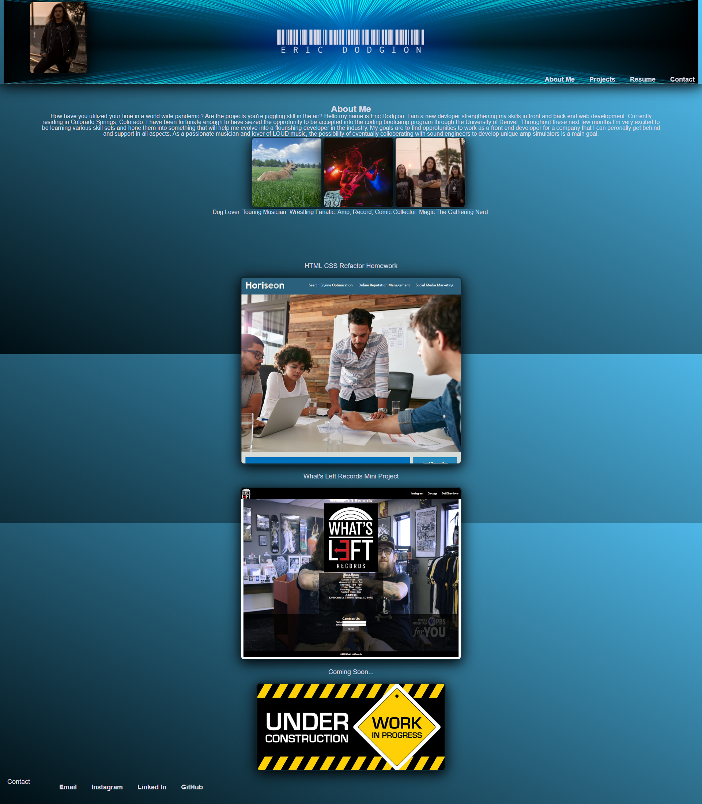

# 02-Advanced-Css-Homework-Demo

In this weeks homework we were given the chance to start building a responsive and fuctional portfolio to carry over into the job market! In my porfolio I have included a big bold header with my name clear as day. A current profile picture of myself along with some facts about myself, goals and aspirations for my future as a developer.  I have also included some pictures of life in the real world. From there I have included some recent applications and a section 'Coming Soon' for links to future projects as I build and devlop this porfolio. Last in my footer I have included several ways to contact me via email, social media, LinkedIn, GitHub and even a direct phone line.  As fas as advenced CSS techniques I have utilized my skills with flexbox, hovering effects directed in my navigation and deployed application links.  The page has also been made reponsive in the viewport.

# Screen shots/how it should look

.png)
.png)


# Credit

This portfoilio was made with ❤️ by Eric Dodgion 02/28/21


```
GIVEN I need to sample a potential employee's previous work
WHEN I load their portfolio
THEN I am presented with the developer's name, a recent photo, and links to sections about them, their work, and how to contact them
WHEN I click one of the links in the navigation
THEN the UI scrolls to the corresponding section
WHEN I click on the link to the section about their work
THEN the UI scrolls to a section with titled images of the developer's applications
WHEN I am presented with the developer's first application
THEN that application's image should be larger in size than the others
WHEN I click on the images of the applications
THEN I am taken to that deployed application
WHEN I resize the page or view the site on various screens and devices
THEN I am presented with a responsive layout that adapts to my viewport
```